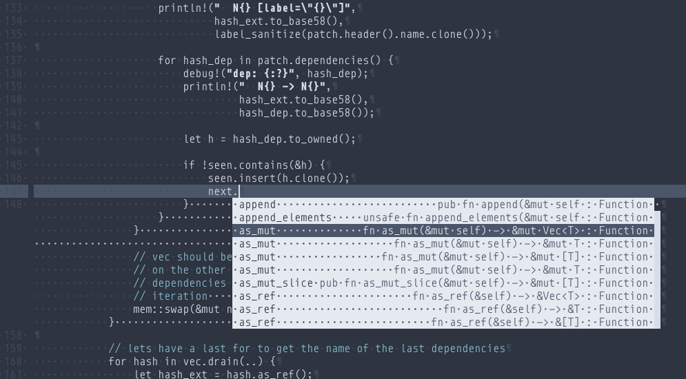
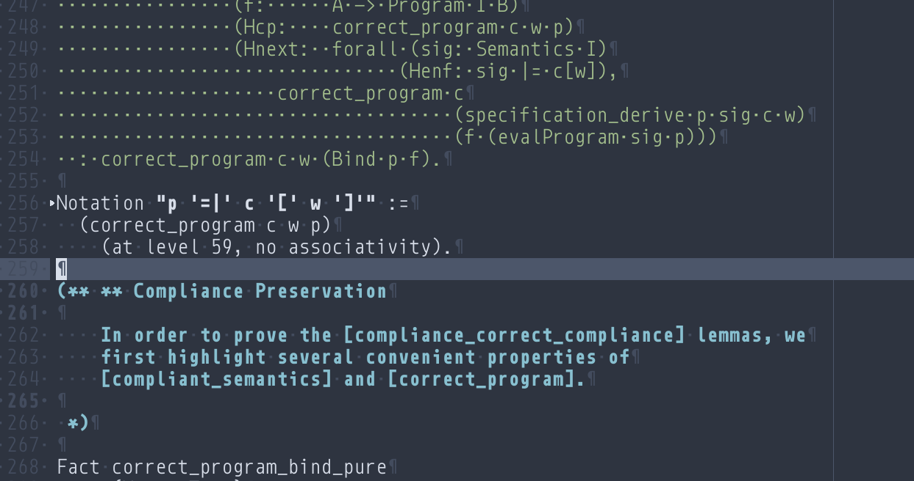

# nordless

`nordless` is a mostly colorless theme, with two main source of inspiration:
[nofrils](https://github.com/robertmeta/nofrils), an extremely minimalist
colorscheme for vim, and [nord](https://github.com/arcticicestudio/nord), a
north-bluish color palette.

`nordless` is distributed under the terms of the GPL-3.0.

## Screenshots

